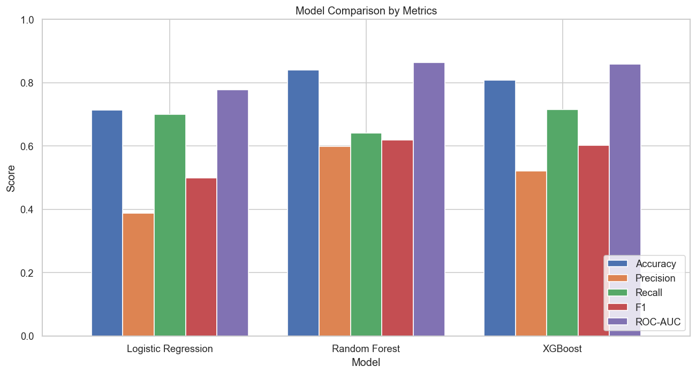
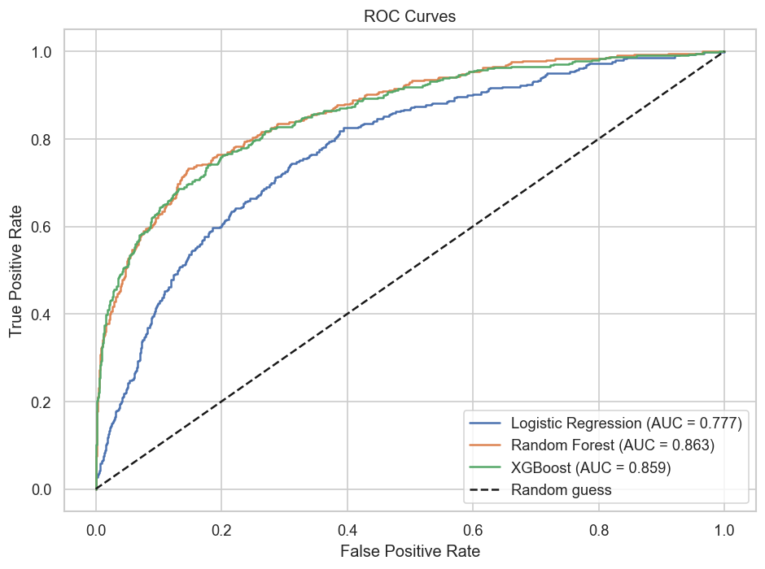
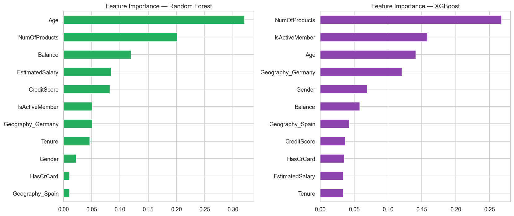

# Bank Customer Churn Prediction

A complete machine learning project that predicts whether a bank customer will leave the bank (churn), based on the classic **Churn Modelling** dataset from Kaggle — 10,000 customers of a European bank operating in France, Germany and Spain.

The pipeline covers the full ML workflow: exploratory data analysis → preprocessing → training three models → metric comparison → feature importance → business conclusions.

## Dataset

Source: [Churn Modelling (Kaggle)](https://www.kaggle.com/datasets/shrutimechlearn/churn-modelling). Download the CSV from Kaggle and place it in `data/Churn_Modelling.csv`.

| Feature | Description |
|---|---|
| CreditScore | Customer credit score |
| Geography | Country (France / Germany / Spain) |
| Gender | Male / Female |
| Age | Customer age |
| Tenure | Years with the bank |
| Balance | Account balance |
| NumOfProducts | Number of bank products used |
| HasCrCard | Has a credit card (0/1) |
| IsActiveMember | Active member flag (0/1) |
| EstimatedSalary | Estimated salary |
| **Exited** | **Target: 1 = churned, 0 = stayed** |

`RowNumber`, `CustomerId` and `Surname` carry no predictive information and are dropped during preprocessing.

## Project Structure

```
├── churn_prediction.py        # main script: EDA → preprocessing → models → evaluation
├── data/
│   └── Churn_Modelling.csv    # dataset (10,000 rows)
├── plots/                     # all generated figures (auto-created)
├── results/
│   └── model_comparison.csv   # metrics table (auto-created)
├── requirements.txt
└── README.md
```

## How to Run

```bash
pip install -r requirements.txt
python churn_prediction.py
```

The script prints the full analysis to the console and saves 9 figures to `plots/`.

## Methodology

1. **EDA** — class balance, feature distributions, churn rate by category, boxplots, correlation matrix.
2. **Preprocessing** — dropping ID columns, label encoding (`Gender`), one-hot encoding (`Geography`), stratified 80/20 train/test split, `StandardScaler` fitted on the training set only (no data leakage).
3. **Class imbalance handling** — only ~20.4% of customers churned, so `class_weight='balanced'` is used for Logistic Regression and Random Forest, and `scale_pos_weight` for XGBoost. This trades a bit of accuracy for much better recall, which matters in churn prediction: missing a leaving customer is more costly than a false alarm.
4. **Models** — Logistic Regression (baseline), Random Forest, XGBoost.

## Results

Test set (2,000 customers):

| Model | Accuracy | Precision | Recall | F1 | ROC-AUC |
|---|---|---|---|---|---|
| Logistic Regression | 0.714 | 0.387 | 0.700 | 0.499 | 0.777 |
| **Random Forest** | **0.838** | **0.595** | 0.636 | **0.615** | **0.863** |
| XGBoost | 0.808 | 0.521 | **0.700** | 0.597 | 0.854 |





**Random Forest** is the best overall model: it leads in F1 (0.615) and ROC-AUC (0.863) while keeping the highest accuracy. **XGBoost** is a close second and catches slightly more churners (recall 0.70), so it may be preferred if missing a leaving customer is especially costly. **Logistic Regression** serves as a baseline: it finds many churners but with too many false alarms (precision 0.39), confirming that the churn pattern is non-linear.

Note on accuracy: with an 80/20 class split, a dummy model that always predicts "stays" already gets ~80% accuracy. That is why model selection here relies on F1, Recall and ROC-AUC.

## Feature Importance — What Drives Churn



Key churn drivers, consistent across all three models:

- **Age** — the strongest factor: churned customers are ~45 years old on average vs ~37 for those who stayed.
- **NumOfProducts** — customers with 2 products are the most loyal (~8% churn); customers with 3–4 products churn almost always (83–100%).
- **IsActiveMember** — inactive customers churn nearly twice as often (27% vs 14%).
- **Geography** — churn in Germany (~32%) is twice as high as in France or Spain (~16%).
- **Balance** — churners hold higher balances on average, meaning the bank loses wealthy customers.

## Conclusions

- Random Forest is the recommended model (best F1 and ROC-AUC); XGBoost is a strong alternative when recall is the priority.
- Retention campaigns should target **older, inactive, high-balance customers, especially in Germany**, and the bank should investigate why holders of 3–4 products are so dissatisfied.

## Tech Stack

Python · pandas · matplotlib · seaborn · scikit-learn · XGBoost
